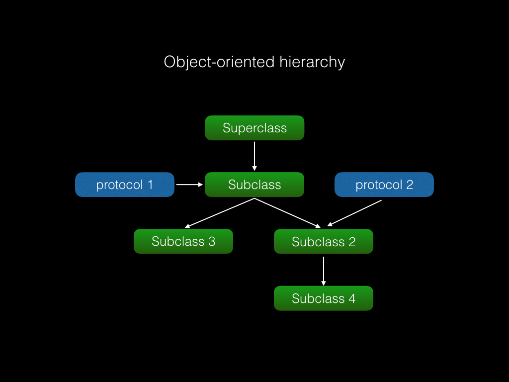
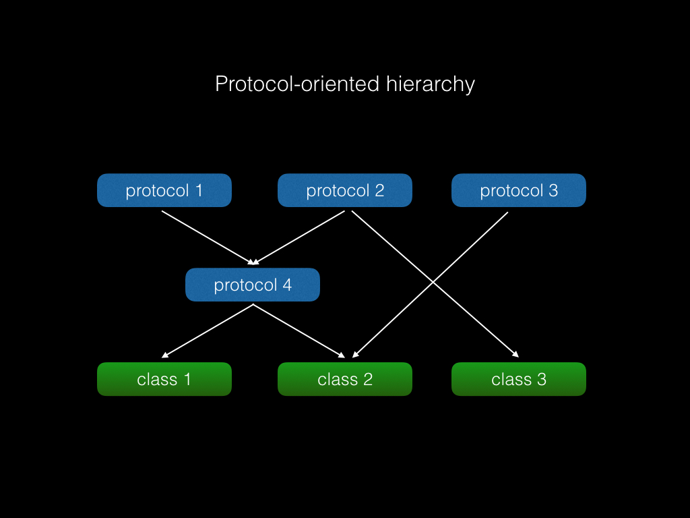

#谈谈Swift面向协议编程

##从一个具体需求说起

应用中有多个页面内的`UICollectionViewCell`需要实现一个相同的小动画：被选中时，先缩小到原来的0.8倍，再回弹到0.9倍。动画本身实现起来不难：

```
    func selectWithBounce(select:Bool, animated:Bool = true){
        let bounce = CAKeyframeAnimation(keyPath: "transform")
        
        let origin = CATransform3DIdentity
        let smallest = CATransform3DMakeScale(0.8, 0.8, 1)
        let small = CATransform3DMakeScale(0.9, 0.9, 1)
        
        let originValue = NSValue(CATransform3D: origin)
        let smallestValue = NSValue(CATransform3D:smallest)
        let smallValue = NSValue(CATransform3D:small)
        
        if animated {
            bounce.duration = 0.2
            bounce.removedOnCompletion = false
            if select {
                bounce.values = [originValue, smallestValue, smallValue]
                self.layer.addAnimation(bounce, forKey: "bounce")
            }else{
                bounce.values = [smallestValue, originValue]
                self.layer.addAnimation(bounce, forKey: "bounce")
            }
        }
        if select {
            self.layer.transform = small
        }else{
            self.layer.transform = origin
        }
    }
```
然而不同的页面有不同的`UICollectionViewCell`子类，怎样方便地让它们都能复用这个动画实现呢？

##面向对象的复用方式

- 继承

如果用面向对象的思维解决问题，最容易想到的就是定义个一个继承自`UICollectionViewCell`的父类，实现这个动画，然后所有需要这个动画的cell都继承它。

能解决问题，但缺点也很明显：如果再来一个实现其他功能的方法需要复用，就没有办法了。Swift/Objective-C只能单继承，如果把一段实现另一个功能的代码也放到这个父类里，就引入了不必要的耦合。继承一个类，就必须接受这个类的所有代码，两部分代码没有关系却必须捆绑销售，代码就开始僵化了。

有的项目里定义了继承`UIViewController`的父类，实现了很多功能，要求项目里所有的页面都要继承它。这种僵化的毛病就很明显了，下面的子类代码全都依赖这个父类，想抽出来复用非常难。

- 组合

组合优于继承这是老生常谈了，用在这里就要定义一个类专门负责做这个动画，然后把`layer`作为方法参数或者成员变量传进来。缺点嘛，就是有点麻烦。这种小工具类多了，要写很多胶水代码。

- Extension/Category

严格意义上讲这个不能算典型的面向对象，而是Swift/Objective-C特有的功能。实现就不说了。缺点也是Extension/Category固有的，给一个类加上这东西会污染所有的对象，即使他们根本不需要这个功能。

##面向协议的复用方式

协议扩展这个特性的引入，使得Swift支持了一种新的编程范式：面向协议编程。针对某个要实现的功能，我们可以使用协议定义出接口，然后利用协议扩展提供默认的实现。

上代码：

```
protocol BounceSelect {
    var layer:CALayer {get}
    var animationDuration:NSTimeInterval {get}
    func selectWithBounce(select:Bool, animated:Bool)
    
}

extension BounceSelect {
    
    var animationDuration:NSTimeInterval {
        return 0.2
    }
    
    func selectWithBounce(select:Bool, animated:Bool = true){
        let bounce = CAKeyframeAnimation(keyPath: "transform")
        
        let origin = CATransform3DIdentity
        let smallest = CATransform3DMakeScale(0.8, 0.8, 1)
        let small = CATransform3DMakeScale(0.9, 0.9, 1)
        
        let originValue = NSValue(CATransform3D: origin)
        let smallestValue = NSValue(CATransform3D:smallest)
        let smallValue = NSValue(CATransform3D:small)
        
        if animated {
            bounce.duration = animationDuration
            bounce.removedOnCompletion = false
            if select {
                bounce.values = [originValue, smallestValue, smallValue]
                self.layer.addAnimation(bounce, forKey: "bounce")
            }else{
                bounce.values = [smallestValue, originValue]
                self.layer.addAnimation(bounce, forKey: "bounce")
            }
        }
        if select {
            self.layer.transform = small
        }else{
            self.layer.transform = origin
        }
    }
}

```

这个协议通过`var layer:CALayer {get}`定义了接入的条件，通过`func selectWithBounce(select:Bool, animated:Bool)`方法的声明和实现，定义了它的功能。

这样，我们的`UICollectionViewCell`子类需要这个功能，只需要声明遵守了这个协议即可。由于`UIView`已经提供了layer属性，子类什么都不用做，直接就可以调用`func selectWithBounce(select:Bool, animated:Bool)`这个方法：

```
class XYZCollectionViewCell : UICollectionViewCell, BounceSelect {
	...
}

let cell: XYZCollectionViewCell
cell.selectWithBounce(true)
```

遵守某个协议的类的对象调用协议声明的方法时，如果类本身没有提供实现，协议扩展提供的默认实现会被调用。

带有默认实现的协议就像一个插件，只要提供一个 CALayer 属性，都可以方便地接入这个功能。这样就可以在不同的类之间（比如`UICollectionViewCell`和`UITableViewCell`）复用这段代码了，解除了对类型的依赖。这是继承无法做到的。

甚至CALayer本身也可以接入这个协议：

```
class XYZLayer : CALayer, BounceSelect {

	//如果想修改动画时长就重载这个属性
	var animationDuration:NSTimeInterval {
		return 0.3
	}
	var layer:CALayer {
		return self
	}
}
```

面向协议编程的好处在于，通过协议+扩展实现一个功能，能够定义所需要的**充分必要**条件，不多也不少。这样就最大程度减少了耦合。使用者可以像搭积木一样随意组合这些协议，写一个class或struct来完成复杂的功能。实际上，Swift的标准库几乎是everything is starting out as a protocol。

在经典的面向对象语言中，对象的层次结构是以对象继承为主干，协议继承为枝叶，大概像这样：




这种层次结构下，如果一个方法想被两个类重用，两个类必须是“直系亲属关系”，一个类必须是另一个的子类。而如果两个类不在一条继承链上，比如图中的subclass3和subclass4，想重用一个方法就做不到了，除非求助于他们的公共父类subclass。但我们往往拿不到公共父类的源代码，即使可以，往往也打破了原先的设计意图。

面向协议的层次结构则打破了单继承的限制，类可以随意继承协议，像这样：



传统的协议（比如Objective-C的protocol，Java的Interface）只能定义接口，不能复用实现，遵守同一个协议的不同的类，只能分别实现协议接口，使用场景受限了很多。Swift只是多了一个协议扩展的特性，但却带来了编程范式的进化。
